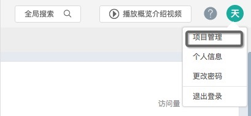
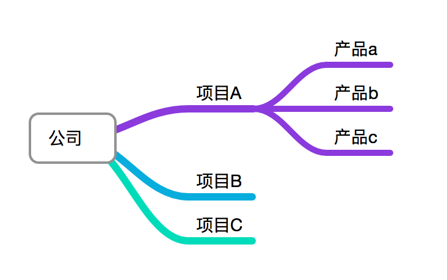

##项目管理
---

####**1.是否可以修改创建者邮箱？**
创建者的邮箱是不能自行修改的，如果您需要更换，请和客服联系修改。

####**2.如何进入项目管理？**
除了创建者之外，其他人的管理权限都是在被邀请时，由邀请者选择的。点击右上角头像图标，看看有没有项目管理的入口，如果有就是管理员及以上权限，如果没有，就是编辑者或普通成员。

####**3.怎么查看项目 ID ？**
管理员及以上权限者，通过右上角个人图标的下拉菜单进入项目管理，选择左侧「项目概览」，页面正上方可以查看项目ID。

####**4.如何删除项目？**
为了避免项目成员误删项目，项目是不可以删除的。

####**5.如何删除应用?**
需要管理员及以上权限，在项目管理里删除后，还要把相应应用的SDK删除，否则会继续收集数据。

####**6.GrowingIO 的项目和产品的关系是？**
如果需要统一管理不同平台 web／iOS／Android 的产品，可以作为不同应用，放在同一个项目下。 同一项目下，如果某个平台 web／iOS／Android 有多个应用，在[概览](https://help.growingio.com/gai_lan.html)里的数据将会合并显示。

如果两个项目完全没有分析的交集，可以建立两个单独项目。

注意：项目下的应用如果想要进行合并和迁移，历史数据是无法迁移的。

####**7.如何删除成员？**
不能删除，只能禁止，禁止后，该成员就没有进入项目的权限了。

####**8.如何添加新项目？？**
需要超级管理员权限，可以在「项目概览」创建。

####**9.创建应用有数量限制吗？**
没有。但是，同一项目下，如果建立了同一平台的多个应用，在概览里的数据是合并显示的。

####**10.怎样添加公司成员及设置权限？**
需要管理员及以上权限，通过左下角的「邀请成员」批量邀请，邀请时可以设置相应的权限：

| 角色名称 | 概览 | 圈选、指标管理 | 我的订阅、单图、看板 | 漏斗、留存、用户分群 | 权限管理
| -- | -- | -- | -- | -- |
| 创建者 | 浏览 | 浏览、新建、编辑、删除 | 浏览、新建、编辑、删除、下载 | 浏览、新建、编辑、删除 | 邀请成员、管理成员权限（管理者、编辑者、普通用户） |
| 管理员 | 浏览 | 浏览、新建、编辑、删除 | 浏览、新建、编辑、删除、下载 | 浏览、新建、编辑、删除 | 邀请成员、管理成员权限（编辑者、普通用户） |
| 编辑者 | 浏览 | 浏览、新建、编辑、删除 | 浏览、新建、编辑 | 浏览、新建、编辑 | 无 |
| 普通用户 | 无 | 无 | 浏览我的订阅、看板 | 无 | 无 |

####**11.怎么修改权限？**
管理员以上权限者可以修改编辑者和普通成员的权限，创建者可以修改所有其他人的权限。

####**12.邀请同事没有收到邮件？**
1.查看垃圾邮箱；
2.稍等几分钟；
3.如果长时间没收到，请联系在线客服。

