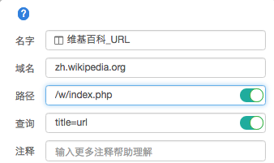

# GrowingIO使用

###数据采集与圈选
---
####**APP 里的 H5 页面支持如何？** 
GrowingIO 支持对 APP 中的 H5 页面进行数据采集和分析。

####**登录 GrowingIO 后加载网站某个页面，但是不能圈选是什么原因呢？	**
登录 GrowingIO 之后，可以看到项目加载页面的 url 地址框右侧带有 1 个小旗帜，如果旗帜是实心的，代表该页面成功加载了 JS 代码；如果是空心的，则代表您的网站未成功加载 GrowingIO 的 JS 代码，也就无法圈选。

####为什么网站产品集成 GrowingIO JS 代码以后，在 GrowingIO 平台内点击网站按钮无法跳转到相应链接？
GrowingIO 是使用 iframe 来加载目标网页进行可视化定义。如果目标网站禁止了 iframe 加载的话，就无法定义标签正常使用。当我们点击某个按钮的时候，页面无法发生跳转且命令行显示 “Refused to display '**' in a frame because it set 'X-Frame-Options' to 'SAMEORIGIN'.” X-Frame-Options 设为 SAMEORIGIN 后就是只允许同个顶级域名加载，需要设置运行iframe加载。  
如果您的网站使用https协议，需将配置修改成   
```
X-Frame-Options: Allow-From https://www.growingio.com  ```

如果您的网站使用http协议，需将配置修改成   
```
X-Frame-Options: Allow-From http://www.growingio.com  ```


####**我页面升级以后 首页很多节点变了位置 是否需要重新定义事件？**
是的。因为我们的圈选逻辑是以页面结构中的 xpath 为基础，节点位置改变意味着 xpath 改变，所以需要重新定义。

####**能否在 iFrame 中进行圈选？	**
如果 iFrame 中的内容集成了 GrowingIO 的代码就可以圈选，否则无法圈选。

####**为什么一些文字不能够被圈选？**
我们目前不会对大于 50 字的文字进行数据收集。如果您想对该文本段进行分析，您可以定义 PV 或者其他元素的浏览量。

####**为什么我圈选的一些元素只有点击数据，没有浏览数据**？	
Angular 1.4 以下版本与 GrowingIO 使用的 MutationObserver 有冲突，解决方案之一是关闭 impression 记录；如果您的网站使用 Angular 1.4  以下版本并关闭之 impression 记录，那么页面上的元素不收集浏览数据； 另外，从采集数据来说，我们只采集倒数两层节点的浏览行为，并且只采集内容不为空的元素。

####**APP 端的数据怎么发送的？ 	**
APP 上的 visit page 和 click 等关键交互事件会即时发送，每小时统计一次；impression 等非关键事件每天晚上发送一次。用户使用 APP 时可能处于断网状态，这种情况下按小时统计时如果客户未接入网络就不能被及时统计到，会在用户接入网络后收集统计。因此按小时统计的某个时间段的数据可能是动态变化的，按天统计的数据会相对稳定。

####**我在数据定义时，在新标签页中打开的页面如何定义？**
您可以将链接复制到「web圈选」中的地址栏，然后就可以圈选了。后续产品中会解决该问题。

####**用户访问环境，如：操作系统、浏览器等信息是如何统计的？为什么统计到的 360 等浏览器的访问很少？**
用户访问环境是从 UA 中获取的。User Agent，简称 UA，中文名为用户代理，是Http协议中的一部分，属于头域的组成部分，向访问网站提供用户所使用的浏览器类型及版本、操作系统及版本、浏览器内核等信息。

用户所访问的网站可以根据这个标识显示不同的排版从而为用户提供更好的体验或者进行信息统计；例如用手机访问 GrowingIO 和电脑访问是不一样的，这些是 GrowingIO 根据访问者的 UA 来判断的。

需要注意的是，出于兼容及推广等目的，很多不同的浏览器的标识相同，因此浏览器标识并不能说明浏览器的真实版本；而且，UA 可以进行伪装。比如，大部分的 360 浏览器并没有在 UA 中提供自己的身份标识，因此当用户使用这些版本的 360 浏览器访问网站时，统计工具无法获知这次访问来自360浏览器，而是会统计成 IE 或者 Google Chrome 浏览器（360 浏览器将自己标识为 IE 或者 Chrome）。

####**定义Web整页时，每个文本框中应该如何填写？**
GrowingIO 使用 URL 来定义整页。             
超文本传输协议（HTTP）的URL包含四个基本元素：协议://域名/路径?查询，比如：http://zh.wikipedia.org/w/index.php?&title=url         

1. 传送协议（最常用的是超文本传输协议 Hypertext Transfer Protocol，缩写为 HTTP）   
2. 服务器（通常为域名） 
3. 路径（以“/”区别路径中的每一个目录名称）          
4. 查询（GET 模式的表单参数，以“?”为起点，每个参数以“&”隔开，再以“=”分开参数名称与资料，通常以UTF8的URL编码，避开冲突）


举个例子：http://zh.wikipedia.org/w/index.php?&title=url   
* **协议：**http     
* **域名(服务器)：**zh.wikipedia.org      
* **路径：**/w/index.php    
* **查询：**?title=url  

 


#### **App上页面的定义是什么**
安卓：一个Activity就是一个页面。

iOS：一个ViewController就是一个页面。

在移动端，完全不同的界面可能属于同一个页面，取决于技术实现，圈选页面时请咨询开发。


#### **微信商城部分页面无法圈选是什么问题？**

该页面需要调用微信认证，我们暂时无法支持微信验证，所以不能圈选。我们正在解决这个问题。

目前的解决方案是，我们可以尝试通过测试服务器绕过微信验证，来解决圈选问题。用测试服务器做圈选，获取商用数据。

###**产品使用**
---
####**为什么搜索、广告来源是空的？**
有些搜索引擎比如百度、谷歌会屏蔽自然搜索的搜索词，这种情况下我们是无法获取关键字的。广告级其他自主投放去到流量按照 UTM 的格式追踪的，详情可以参考 [渠道跟踪](https://help.growingio.com/channeltrack.html)。

####**如果我要看百度竞价来的用户数有多少怎么看？**
我们可以区分不同渠道的流量，请参考文档[『自主投放』](https://help.growingio.com/channeltrack.html)部分；通过上述方法区分出百度竞价的维度值，使用『访问用户』或者『登录用户』的指标即可。

####**请问渠道跟踪怎么使用？**
详情可以参考帮助文档 [渠道跟踪](https://help.growingio.com/channeltrack.html)。

####**我要如何在 GrowingIO上进行用户细查？**
首先建立一个您关心的用户分群，然后点击该分群就可以进入用户细查的界面。

####**为什么用户细查的时序有时候不对?**
1. 在用户细查中，我们是按照用户访问的 session 倒序排列的，session 内的事件是按照时间先后顺利排列的；
2. 细查中事件时间对应的是 GrowingIO 服务器收到的该事件的时间，而不是客户端记录的事件发生时间，需要说明的是，大部分情况下客户端时间和服务器时间的差异很小。使用服务器时间的原因是很多时候客户端时间不可信（比如电脑时间没有同步服务端，导致与服务端时间相差几分钟或者 1 个时区；比如某个用户将自己的手机时间年份设置为 1990 年，实际年份为 2016 年），因此需要在服务端做时间校正；校正时没有考虑网络请求所花费的时间，带来的影响是网络波动的时候有可能就会出现事件的时序是不完全正确的。

####**我要如何看我们产品的每一页 PV？**
您可以先定义全站的 PV 指标，然后在作图的时候选择"页面"维度即可。

####**你们的概览数据都是按天展现的，如何实现按月的数据展现呢？**
目前 GrowingIO 的概览页面暂不支持按月展示数据；您可以在制作单图的时候自由选择时间范围。

####**GrowingIO 概览中的数据是多久更新一次呢？**
GrowingIO 概览所呈现的数据是每小时更新的。

####**推广跟踪支持到什么级别？推广 URL 里有自定义的内容，能否自动抓取？**
流量渠道跟踪详情请参考：[渠道跟踪](https://help.growingio.com/channeltrack.html) 。

####**我要如何用 GrowingIO 来看我 App 每天的 DAU 呢？**
概览中提供的『访问用户量』指标，即是您 App 每日的访问用户量


####**APP 端除了 DAU 和 VisitPage ，还能做什么样的分析呢？**
您可以圈选您关注的元素，然后在 Web 平台上制作多种分析报表，也可以进行留存分析，用户分群，用户细查，漏斗分析等多种高级分析。

####**留存分析中在留存趋势细节表中切换天、周留存，为什么显示用户数不同？**
造成用户数差异的原因有：
1. 周留存分析时会根据设置的时间范围调整到自然周，比如设置的时间为周三，在分析周留存的时候会自动从当周的周一开始分析。所以周留存和天留存的统计时间范围可能是不同的。
2. 周留存中的用户数表示当周做过起始行为的用户，如果用户在当周的三天做过起始行为，在天留存表中会表示为三个用户，而在周留存表中会表示为一个。

####**为什么项目管理页面打不开、有些功能无法正确使用？**
可能是由于浏览器适配问题，我们暂时支持Chrome，在IE、Firefox等浏览器打开的时候可能会发生错误。给您带来的困扰非常抱歉，建议您使用Chrome浏览器。

####**在用户细查中查看用户行为时“N/A”是什么意思？**
“N/A”表示网站或者App上面没有文本内容的元素，比如某些icon。

####**在web圈选的时候，为什么有时候会一下圈出一组同类元素，有办法区分开么？**
GrowingIO根据您网站HTML结构识别和定义页面上的元素。有的时候网站上的HTML标签写法完全相同，呈现在页面上的几个同类元素，可能HTML代码完全相同。此时GrowingIO采集、圈选数据时无法区分开。我们通过HTML标签的id和class来区分元素，这种情况下您可以在需要区分的标签class中添加一些字符串用于区分。