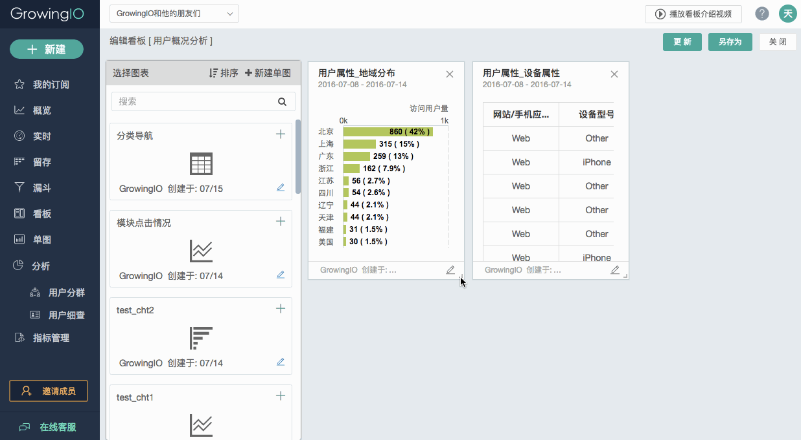

# 看板

<video id="video" controls="" preload="auto" 
      <source id="mp4" src="https://assets.growingio.com/videos/看板订阅_720p.mp4" type="video/mp4" style="width:80%; margin:0 auto;">
      
      
Your user agent does not support the HTML5 Video element.

    </video>

 
 

 
看板更够帮助您将相互关联的单图集合在一起，兼顾全面性与单独性，既能够从多个图表中发现关联，也可以对单个图表进行深入分析，方便每天查看相应的数据。

所以在创建看板之前，请先制作并保存单图。

通常情况下，一个看板可以满足相同业务的人员的使用需求：
* 产品经理的看板可能是项目的核心指标；
* 市场人员的看板可能是监控各个渠道来源指标；
* 销售的看板可能是潜在客户的活跃度…

进入看板页面后，只需把需要的单图从左侧的列表中拖曳到右侧即可：

目前还支持自定义的顺序调整和大小调整，可以按照图表的优先级别和重要程度进行排列：

