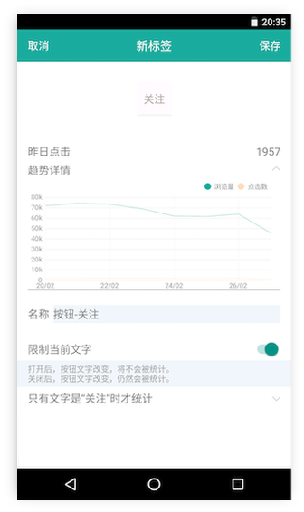
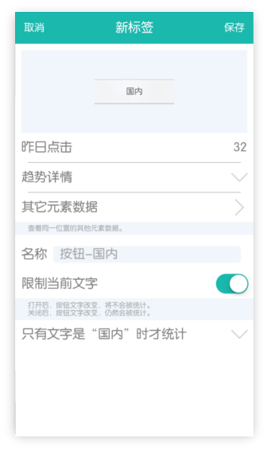

# 移动端直接圈选

从9月20日起，我们发布了新版的移动端SDK（安卓大于等于0.9.96，iOS大于等于0.9.37）。如果您集成了新版的移动端SDK，请点击[这里](https://help.growingio.com/Features/circle/appcirclingapp_new.html)查看新版的圈选方式。

<video id="video" controls="" preload="auto" 
      <source id="mp4" src="https://assets.growingio.com/videos/APP圈选APP_570p.mp4" type="video/mp4" style="width:30%; margin:0 auto;">
      
      
Your user agent does not support the HTML5 Video element.

    </video>

 
 

在移动端进行圈选，您就能够创建移动端标签了。在这部分的教程中，我们将系统的介绍：

*  <a href="#Android">Android App 激活和圈选的具体步骤</a>
*  <a href="#iOS">iOS App 激活和圈选的具体步骤</a>

##准备工作
请接入SDK，并把集成SDK的App安装到您的手机。  
请确保使用已发布的最新版App进行圈选，以防因为版本不同，出现数据量偏差。

注意：安卓移动端圈选在小米开发者版本和 MIUI8稳定版下调不起小红点，是因为这两个版本系统禁止了悬浮框权限，您可以先尝试信任下。步骤：安全中心-授权管理-应用权限管理-找到您要设置权限的app-找到悬浮框权限-进行授权信任。当然也可以换用其他安卓手机进行圈选。

##Android版具体步骤

**1. 激活圈选** 

您需要先安装我们的GrowingIOApp，您可以在http://pre.im/GIOApp 进行下载。	

Step 1. 打开GrowingIOApp，用您的GrowingIO账户登录       
Step 2. 在GrowingIOApp中，点击右上角的“定义”，唤醒您的App

*如果您使用的是0.8.24或更早版本的SDK，请先升级到最新版来圈选
 

**2.拖动小圆圈进行圈选**       
您可以把小圆圈拖动到要统计的按钮上，放开后会出现定义标签的界面。

 
**3.保存**  
在定义标签界面保存后，这次圈选就完成了。

**4.在网站上进行数据分析**

您可以在网站的“标签管理”中找到圈选生成的标签，并在“新建”->"新建单图"中，用标签制作各种有用的图表。

##iOS版具体步骤

**1. 激活圈选**  

**方法一**  

Step 1. 在您的「项目管理」列表中，找到App对应的**URL Scheme**（例如：growing.c82c0bxxxxxxxe0a6）
  
Step 2. 在手机浏览器的地址栏输入**您的URL Scheme + :// **(把它当做一个网页链接)  
    
     例如:“growing.c82c0bxxxxxxxe0a6://”
       
Step 3. 此时将会自动打开您集成SDK的App

**方法二**  

Step 1. 把您的邮箱通过官网在线客服或者其它渠道发给我们，我们会邀请您从TestFlight上下载GrowingIO应用

Step 2. 通过TestFlight安装GrowingIO应用

Step 3. 打开GrowingIO应用，用您的GrowingIO账户登录

Step 4. 点击要圈选的应用程序，然后点击右上角的“去圈选”按钮（需要确保被圈选的程序已经安装），此时会跳转到您的App
  
**2. 进行登录**  
输入您的账号密码进行登录，成功之后会看到一个小圆圈。

**3. 拖动小圆圈进行圈选**       
您可以把小圆圈拖动到要统计的按钮上，放开后会出现定义标签的界面。

 
**4. 保存**  
在定义标签界面保存后，这次圈选就完成了。

**5. 在网站上进行数据分析**  
您可以在网站的“标签管理”中找到圈选生成的标签，并在“新建”->"新建单图"中，用标签制作各种有用的图表。

  
    
      
        
          
          