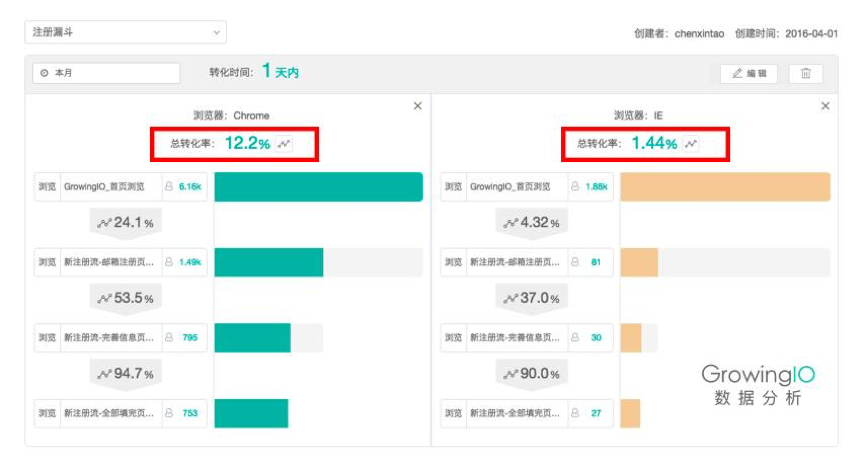
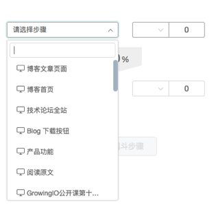
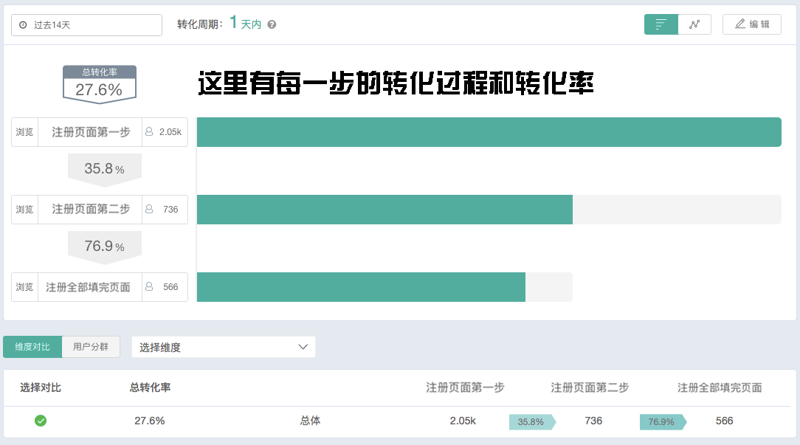
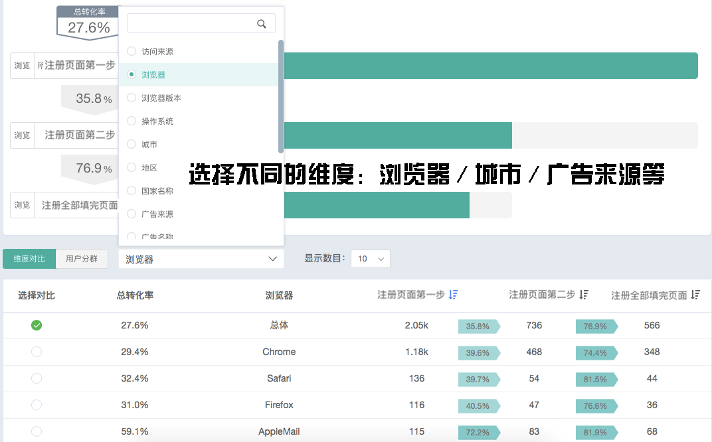
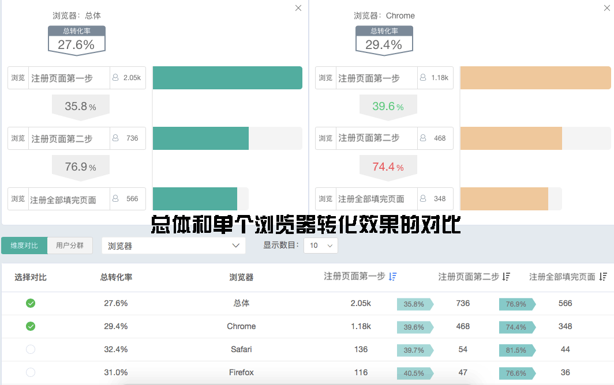

#漏斗
 
* <a href='#case1'>使用场景和案例</a>
* <a href='#case2'>建立你的第一个漏斗</a>
* <a href='#case3'>漏斗的常见问题</a>

---

<video id="video" controls="" preload="auto" 
      <source id="mp4" src="https://assets.growingio.com/videos/漏斗_720p.mp4" type="video/mp4" style="width:80%; margin:0 auto;">
      
      
Your user agent does not support the HTML5 Video element.

    </video>

 
 

 
漏斗是衡量转化效果、进行转化分析的重要工具，GrowingIO 的漏斗功能能够
帮助您清晰地了解转化情况，并且从多种角度进行剖析对比，发现关键流失步骤，定位问题，提升转化表现。

 ＊数据需要传输时间，加载SDK开始，第二天可以创建前一天及之前的转化漏斗。

##使用场景和案例
###案例1：「GrowingIO」发现注册流程不适配某个重要浏览器版本
我们建立了一个注册转化漏斗，并从中发现，注册第一步到最后注册完成的总体转化率是 7% 左右。但是，使用 IE 浏览器接入的转化率为 1.4% ，而使用谷歌浏览器接入的转化率为 12.2% ，竟然有着近十倍的转化差异。也就是说只要改进这一个地方，就有可能大幅提高转化。

首先我们从衰减最高的页面入手，通过排查发现，当用户使用 IE 浏览器时，每次在第一个页面输完个人信息后，页面往往会自动跳转到登陆页面，并没有进入输入公司信息页面的流程。因为 IE 浏览器的框架对新语言并不是非常支持，于是我们对这个适配进行了调整。

当 GrowingIO 把这个错误修改以后，总体注册转化率从 7% 提升到了 12% 。
通过漏斗分析，找到最终原因的时间大大缩短，一个人一个小时即可搞定，实现“开源节流”。

<h2>建立你的第一个漏斗</h2>

1.在漏斗页面点击右上角的「创建漏斗」，进入漏斗创建页面。
 
2.为漏斗命名，并确定时间区间，可以选择昨天及之前的时间，暂不支持创建今天的漏斗，转化周期代表着转化需要在这个周期里完成，如果没有完成，就视为流失。
 
 
<pre>例如：注册的转化周期一般是1天。 </pre> 
 

 
3.在页面左侧「请选择步骤」里选择您需要分析的步骤，如果步骤为空，请先圈选创建。
 

 
一个漏斗至少要添加两个步骤，每个步骤对应一个指标（事件），目前支持最多 10 个步骤。

 

    例如：打开首页页面->打开商品详情页->点击加入购物车->点击结算按钮->打开「付款成功」页面

 这就是有 5 个步骤的转化流程，第 2 个步骤里的用户，必须首先是第 1 步骤里的用户，以此类推。
 
 
4.添加好相应步骤后，每一步都会实时计算出相应的转化率。灰色的部分是达成每一步转化的用户与上一步的差值，就是这个转化环节的流失用户量。点击右上角的符号，可以切换转化率和转化率趋势。

5.漏斗建好后，我们可以根据维度和分群进行更具体的细分对比。

**a.维度**

在漏斗中，我们提供了丰富的维度，包括：访问来源，搜索词，城市，地区，国家名称，广告来源，广告名称，广告内容，广告关键字，广告媒介。除此之外，还可以使用自己配置的自定义维度，满足个性化的分析需求。

**b.分群**

也可以在漏斗中加入多个用户分群，以查看这些用户分群之间的转化率差异。

    例如：通过对比某个浏览器版本的转化效果和总体或其他浏览器版本的转化效果。

**c.两个漏斗对比**

也可以选择任意两个转化过程进行详细的对比。

    例如：对比某个版本的浏览器的转化和总体或其他浏览器的转化，以了解自己的产品对不同浏览器的适配情况，及时发现其中的异常。

这样，我们做好了一个漏斗，通过漏斗转化可以发现很多可以改进的空间，优化产品，可以看看下面的使用场景和案例。

##使用漏斗的常见问题

####1.为什么我的漏斗里「选择步骤」是空的？

建立漏斗前，请先圈选，通过圈选创建需要的指标，作为漏斗步骤里的事件。

####2.漏斗里的数是用户量吗？
  
是

####3.为什么我不能选择当天的时间？

目前支持昨天及之前的时间。

####4.为什么我的漏斗（有的步骤）没有数？

您可以检查下是否每一步的指标都有数，比如说是否某一步是新建立的指标，需要等到第二天才有数据。