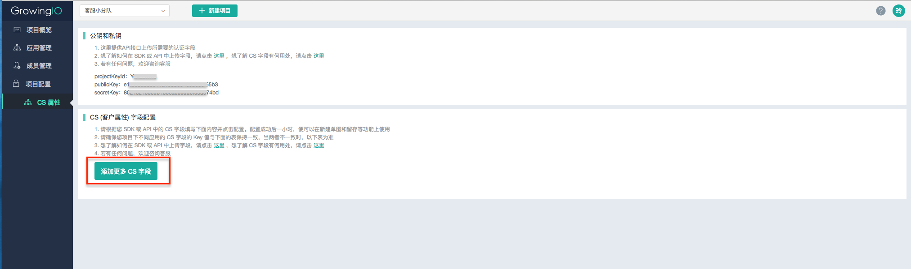
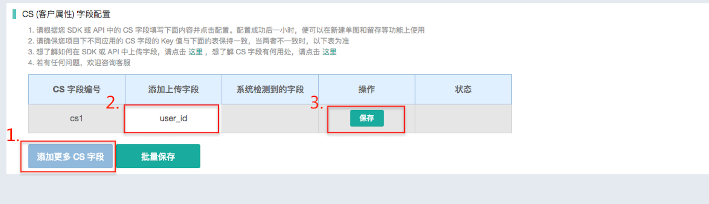

# 用户属性数据上传配置文档

## 用户属性字段配置

当您通过 SDK 或 API 上传 用户属性字段两小时后，需要在「项目管理-项目配置-用户属性」中进行配置。如果上传字段未满两小时，系统可能因检测不到数据而配置不成功。只有配置成功的字段，才能在数据分析中使用。

本页面会默认显示配置成功的用户属性字段，您可以根据这个页面来管理您各个产品中的用户属性字段，确保上传的用户属性字段数据一致。在您更改或删除了用户属性字段时，需要在本页面进行字段更新后才能生效。

* 第一步：进入「项目管理-项目配置-用户属性」中，点击“添加更多用户属性字段”

* 1第二步：根据您上传的用户属性值填写“添加上传字段”一栏。系统会自动检测上传的字段值，如果已经上传且字段一致，则会成功保存

  

您也可以添加完所有上传字段后，点击“批量保存”，提高保存速度。

当您配置完成后，您可以去用户分群的“维度”里面去查看您配置的用户属性。

## 常见问题及解决方案

1. 配置失败：系统检测字段为空
 * 问题原因：当您上传用户属性字段未满两小时，或者您的产品在四小时内未上传过数据，系统将检测不到您上传的字段值
 * 解决方案：前者在上传用户属性字段两个小时后配置即可。后者需要您先使用您的产品，产品才能将您的使用数据上传给系统，系统便能成功检测到数据。
2. 配置失败：字段不一致
 * 问题原因：当您在同一个用户属性字段上，保存的 KEY 值与您实际上传并被系统检测到的 KEY 值不一致时，提示配置字段失败
 * 解决方案：请您确认系统检测到的 KEY 值是否为您实际想要上传的 KEY 值。如果是，则将修改 KEY 值和系统检测值保持一致。如果不是，则需要更新您上传的用户属性字段对应的 KEY 值，确保上传数据准确
3. 保存失败：服务器出错
 * 问题原因：当服务器出现问题时，您在配置 KEY 值会出现问题，提示保存失败
 * 解决方案：重新保存即可
4. 字段异常
 * 问题原因：当您在同一个用户属性字段上传了不同的 KEY 值时，系统就会提示您字段异常。一般有两个原因，一是不同产品里上传了不同的 KEY 值，二是同个产品在不同时期上传了不同的 KEY 值。举例说明如下，一是在产品A的 CS1 字段里上传了 user\_id，在产品B的 CS1 字段上传了 user\_name，则会提示异常。二是同个产品的 CS1 字段在1月份上传了 shop\_id，在6月份又上传了 shop\_name，那么可能会存在历史数据，提示异常
 * 解决方案：在这种情况下，我们会依旧按照您保存的 KEY 值进行存储，您这边需要检查确认各端产品最新上传字段与保存的一致
5. 以上答案若不能解决您的问题，您可以请您的技术同学打印出 Log 自查下，方法如下：
 * 请开发打开调试 log，登录后，搜索 page，看是否这个 channelId 对应的 CS 字段以及 CS 字段的值，如果设置了，就会有 CS 字段以及相应的值。
 * 可以测试几个场景：账号的登录-退出相互切换、自动登录场景，看这几个场景打出的 log 中的 CS 字段是否正确。
 * 打开调试 Log 方式请分别参考iOS及Android SDK 接入文档。

