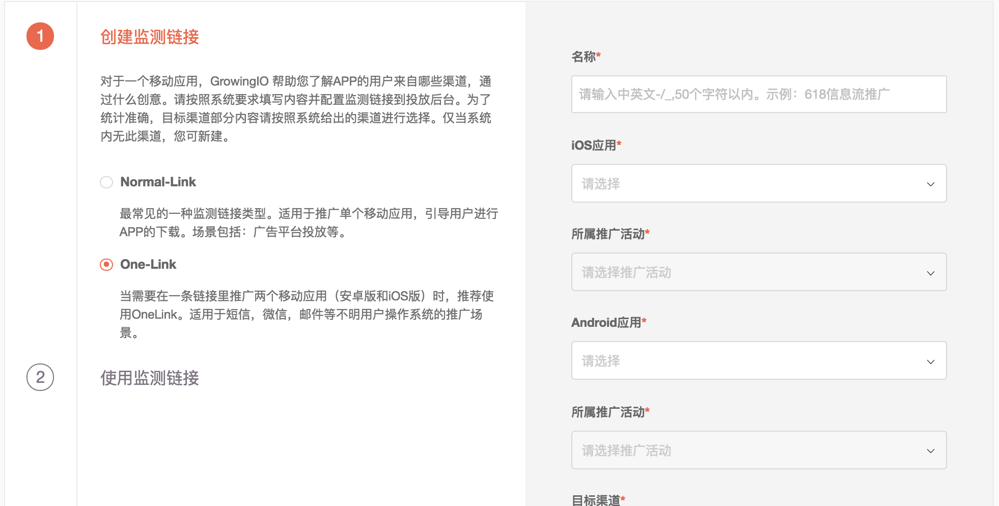
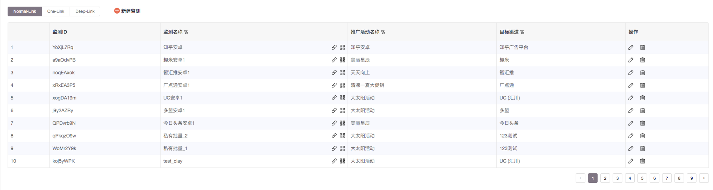
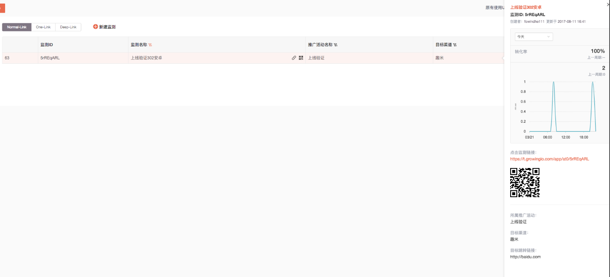

# 使用方法

## 新建链接概述

1. 点击进入GIO后台，广告监测，要推广的APP。
2. 进入“配置与管理”模块“推广管理”，点击“新建监测”。
3. 按照系统要求填写内容。监测链接为您自定义命名，示例：百度618投放。推广活动也是您自定义的维度，如：市场部八月投放等。
4. 根据您要投放的实际渠道进行渠道选择。特别说明：如果系统已经存在的渠道，建议您直接选择。
5. 根据您的实际投放情况选择不同的链接类型。
6. 如果需要生成多条链接，新建过程中可以选择“批量创建”。
7. 获取监测链接（或二维码），用于投放。

### One-Link

当你需要使用一条监测链接同时推广iOS和安卓APP时，使用此类型。

1. 按照系统引导创建链接。
2. 创建过程中，如果名称为“监测链接0327”，完成后在“推广管理”页面切换“One-Link”tab进行链接管理。
3. 点击每条链接可以在右侧滑出“快速预览”，切换操作系统分别查看iOS及安卓的数据。
4. 在“基础数据” 模块，One-Link类型的链接会分化成形如“监测链接0327-Onelink\_iOS”及“监测链接0327-Onelink\_Android“两条链接。

### Deep-Link

当你需要已安装用户站外点击链接可以直接打开APP时，可以使用Deep-Link类型。

1. 按照系统引导创建监测链接。
2. 创建完成后在“推广管理”页面切换“Deep-Link”tab进行链接管理。
3. 点击每条链接可以在右侧滑出“快速预览”，切换操作系统分别查看iOS及安卓的数据。
4. 针对Deep-Link类型，系统在其他类型链接统计指标之外，提供了“唤醒”指标，衡量多少人通过链接重新打开APP。
5. 在“基础数据” 模块，Deep-Link类型的链接会分化成形如“监测链接0327-Deeplink\_iOS”及“监测链接0327-Deeplink\_Android“两条链接，增加“唤醒”及“唤醒转化率”两个指标。
6. 此功能需要升级到SDK2.3.0以上。

特别说明：Deep-Link目前在内测中，如需体验请页面申请或者联系GIO CSM或发送邮件至adtrack@growing.io。

## 推广管理

使用推广管理模块进行链接的增删改查。

点击每条链接右侧可以快速滑出快速预览。

