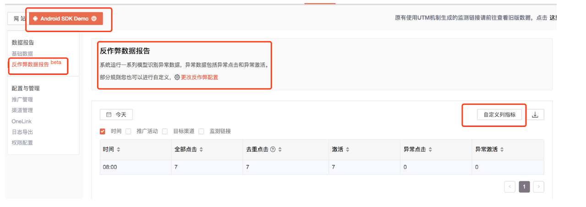

# 数据报表

## 基础数据

### 激活概览

系统为每个应用统计全部激活，推广激活，自然激活以及新登录和次日留存数据。可分天，分小时查看。

### 推广详细

1. 点击选择您要查看的APP，进入“基础数据” ，“推广详细”模块。
2. 推广数据可分天查看，也可查看今天分小时数据。数据实时提供。
3. 有小箭头的字段支持排序。
4. 有筛选图标的字段支持筛选，支持的字段有：目标渠道，监测链接，推广活动。
5. 点击“自定义列指标”，选择需要的指标数据。可选的指标有：展现，去重点击，点击率，激活，转化率，次日留存，新登录。
6. 查询结果可直接下载。

## 异常数据报告

系统会针对广告投放运行一系列模型&规则识别数据的异常性，并提供相关数据报告。 1. 选中目标APP，进入“基础数据”中“异常数据报告”模块。 2. 可以根据业务诉求进行部分异常数据识别规则配置。 3. 可点击“自定义列指标”进行指标选择，可选择的列指标有：去重点击，激活，异常点击，异常激活。

## 深度分析

GIO提供事件分析，留存分析，漏斗分析，分群分析。采取以下步骤可以进行不同渠道效果的深度事件分析：

1. 选择分析模块-“事件分析”，新建“事件分析”。
2. 选择要分析的指标。
3. 选择要分析的推广维度，可选维度有：监测链接，推广活动，目标渠道。

以上逻辑可沿用在分群，漏斗分析等地方，引用相关维度即可进行深度分析。

