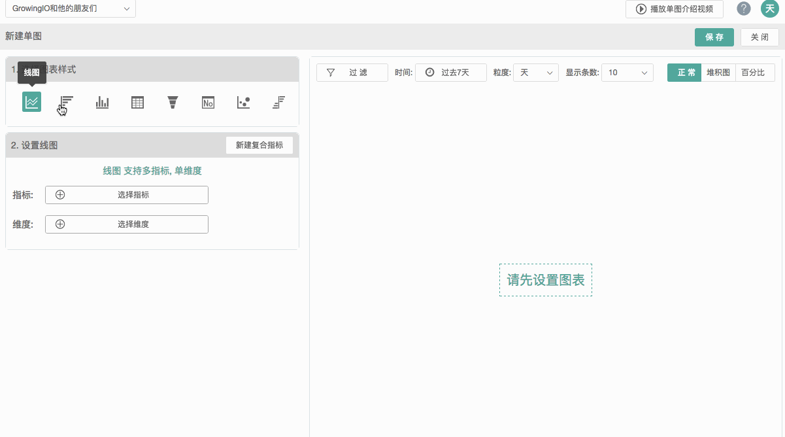
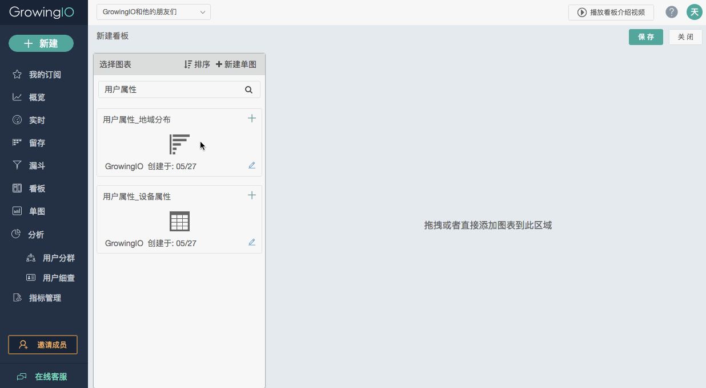

# 快速使用

GrowingIO 是基于用户行为的新一代数据分析产品，吸取了国内外数据分析的最佳实践，创新了一整套数据采集和分析解决方案，为用户获取全量、实时行为数据。

 ＊部分浏览器可能出现不兼容的情况，推荐使用 Chrome 浏览器。

##1.准备工作：加载SDK

请您邀请工程师接入一段 SDK 代码，作为接下来数据采集和分析的准备：[SDK 接入指南（JS）](https://docs.growingio.com/SDK/JS.html)／[SDK 接入指南（Android）](https://docs.growingio.com/SDK/Android.html)／[SDK 接入指南（iOS）](https://docs.growingio.com/SDK/iOS.html)。

在接入 SDK 前，选择创建项目还是应用时，需要注意的是：

* 
如果需要统一管理不同平台 web／iOS／Android 的产品，可以作为不同应用，放在同一个项目下。 同一项目下，如果某个平台 web／iOS／Android 有多个应用，在[概览](https://docs.growingio.com/Features/overview.html)里的数据将会合并显示。

* 
如果两个项目完全没有分析的交集，可以建立两个单独项目。

注意：项目下的应用如果想要进行合并和迁移，历史数据是无法迁移的。

##2.通过「实时」和「概览」来监控网站的流量情况

### 2.1 实时

在实时里，可以看到用户在网站上的即时行为，实时监控产品的运行状态，包括当前网站的在线用户数，用户来源及用户使用产品的情况等。

尤其适用于：

* 活动上线后，实时监控流量，直观了解用户打开页面参与活动的情况，并由此随时优化活动细节；

* 
产品新功能上线后，实时监控用户是否在很好地接受和使用新上线的功能，并及时调整。

###2.2 概览
在概览里，可以看到网站整体流量的情况，包括页面浏览量趋势、访问用户趋势、登录用户趋势、每次会话浏览页数、新访问用户量趋势、新登录用户量趋势等。数据传输需要一定时间，如果是刚刚加载 SDK ，请稍等1-2个小时。

##3.通过「热图圈选」或「直接圈选」定义需要的指标
使用 GrowingIO 是不需要前期埋点的，加载相应页面的 SDK 后，需要对所需页面和元素进行圈选和定义，保存成接下来分析需要的指标，因此，在制作下面任何图表之前，都建议先圈选所需元素。

直接圈选操作页面：

[圈选 web 页面和元素的详细操作](https://docs.growingio.com/Features/circle/Web.html)／[在电脑上圈选 APP 页面和元素的详细操作](https://docs.growingio.com/Features/circle/iOSorAndroid.html)／[用 GrowingIO APP 圈选 APP 页面和元素的详细操作](https://docs.growingio.com/Features/circle/appcirclingapp_new.html)

GrwoingIO 的[「热图」](https://docs.growingio.com/Features/heatmap.html)是基于内容的，记录用户在网站内容上的点击行为，以高亮颜色直观地显示点击热度。还可以在热图里直接圈选，让圈选和数据分析更有目的性和针对性，目前支持 web 端圈选。

##4.制作相应的「单图」和「看板」

### 4.1 单图

单图是最直接展示分析结果的方法，GrowingIO 提供了包括线图、横向柱图、纵向柱图、表格、漏斗图、数值、气泡图和双向柱图在内的 8 种图表样式。每天查看相应单图，可以快速地了解相关数据的表现。

](/assets/单图)

[单图的详细介绍](https://docs.growingio.com/%E5%8D%95%E5%9B%BE.html)

###4.2 看板
看板能够帮助您将有关联的图表集合在一起，更加高效和便捷。拖曳左侧相应的单图到右面的空白处，就可以建立相应的看板：

](/assets/看板)

不同图表的重要程度不同，可以拖曳图表调整排列顺序，通过每个单图右下角的 」调整图表大小。

##5.更多功能

加载 SDK 一段时间后，积累了一定的数据量，就可以进行更加深入的分析了包括用[「漏斗」](https://docs.growingio.com/%E6%BC%8F%E6%96%97.html)分析转化效果，了解用户的[「留存」](https://docs.growingio.com/retention.html)情况，通过[「用户分群」](https://docs.growingio.com/usersegmentation.html)和[「用户细查」](https://docs.growingio.com/%E7%94%A8%E6%88%B7%E7%BB%86%E6%9F%A5.html)精准定位问题等。

如有其它问题，请查看[「常见问题」](https://docs.growingio.com/FAQ.html)。

