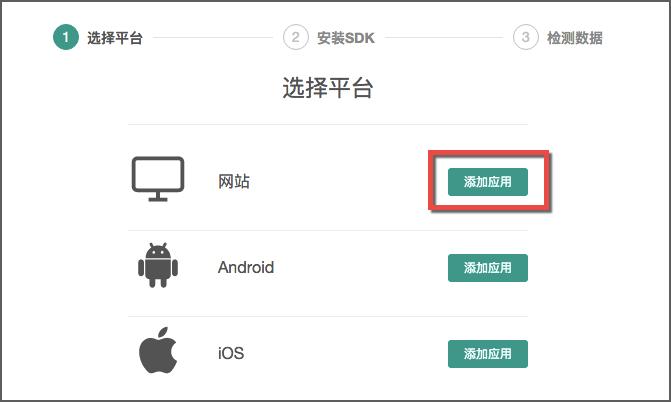
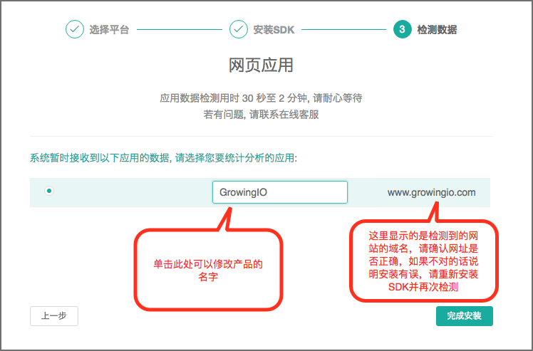

# 第一步：SDK 接入

**注意事项**

**新建项目时必须思考数据分离，不同项目请使用不同的项目ID，GrowingIO使用项目ID标识数据主体，不同项目若使用同一ID会将数据混合在一起，影响单个项目的数据分析。在APP端若是集成错误，会在一段时间内影响数据分析结果，必须慎重考虑**

GrowingIO 需要在你的产品中添加 SDK 代码来实现无埋点数据采集。而这一次代码安装，就能省去后续编程、手动埋点、等待数据的时间成本。

目前 GrowingIO 的 SDK 按照支持产品的类型，分为 JS、iOS、Android 三种。

在初次注册 GrowingIO 账号之后，就会提示选择平台，添加应用。

如果是网页或 HTML5 产品，选择【网站】，按照说明将代码添加到网页的&lt;head>和&lt;/head>标签之间即可，然后点击【去检测 SDK 安装状态】。   

等待两分钟左右，检测成功。此时需要确认网站的域名，并给网站取一个名字，方便以后辨认，最后点击【完成安装】，SDK 就集成好了。

如果是 App 客户端，在第一步选择对应的平台类型后，也是同样按照说明安装 SDK，检测数据并取名即可。

PS：如果你对代码不熟悉，可直接将系统生成的代码和[这个文档](https://help.growingio.com/SDKInstructions.html)转交给工程师同事 :-)