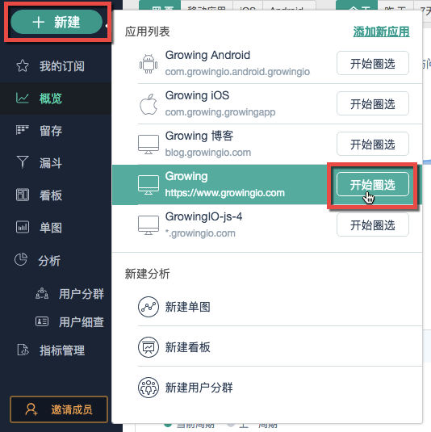
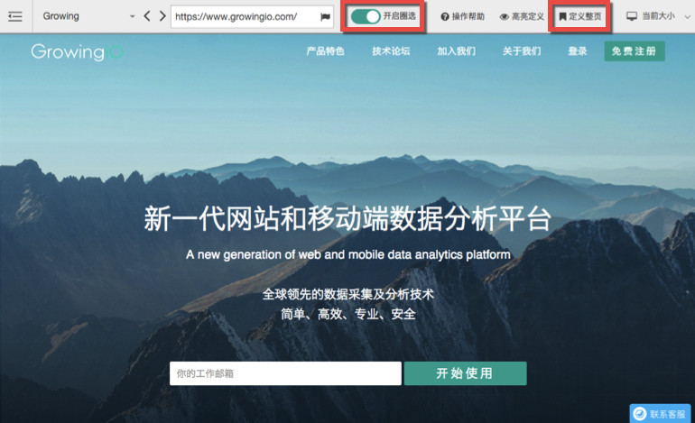
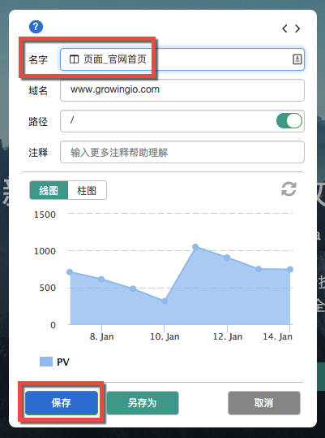
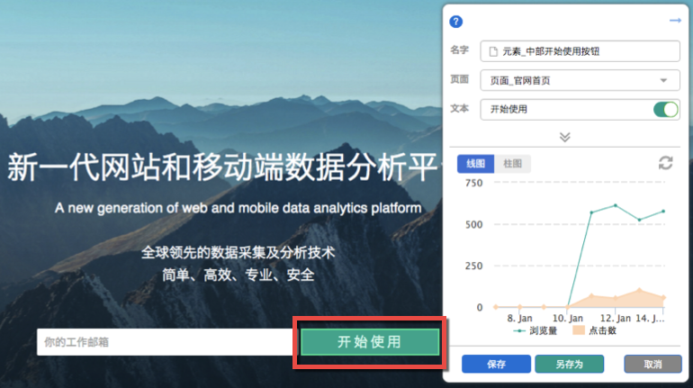

# 第二步：圈选数据

一旦SDK安装成功，就意味着GrowingIO的代码已经勤勤恳恳地开始收集用户行为数据了。此时您可以在【概览】中看到我们预置好的一些指标和图标，如页面总浏览量、访问用户量等。概览可以帮助您了解网站的整体运营概况，而如果想要进行一些自定义分析的话，就要先从**圈选数据**开始，自己制作一些报表。

【圈选】的意思是：指定一个元素，查看它的浏览/点击数据。这个元素可以是：页面、按钮、文字、图片……等等。

点击【新建】按钮，在产品列表中找到想要圈选的产品。在这个例子中，我想要圈选的是GrowingIO的官方网站，点击了【开始圈选】之后，GrowingIO就直接打开了我的网页。

点击【定义整页】，就可以查看这个页面的浏览数据了。

将名字改成我和同事都能看懂的“页面_官网首页”，再点击【保存】。

在网页上的按钮/文字/图片等任意地方点击，进行【圈选】，就能查看这个元素的浏览和点击数据了。在这个例子中，我圈选了首页右上角、中部和底部的三个免费注册/开始使用的按钮，分别保存。

PS：iOS/Android客户端也能对任意元素进行圈选，详见[这里](https://help.growingio.com/Features/circle/iOSorAndroid.html)和[这里](https://help.growingio.com/Features/circle/mobile.html)。