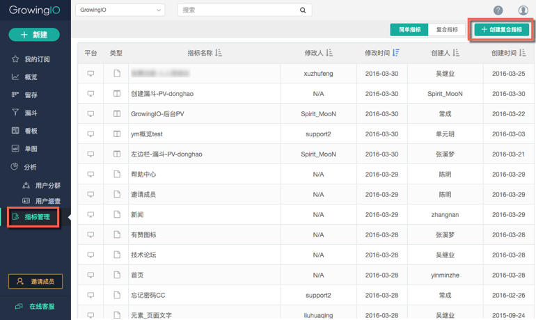
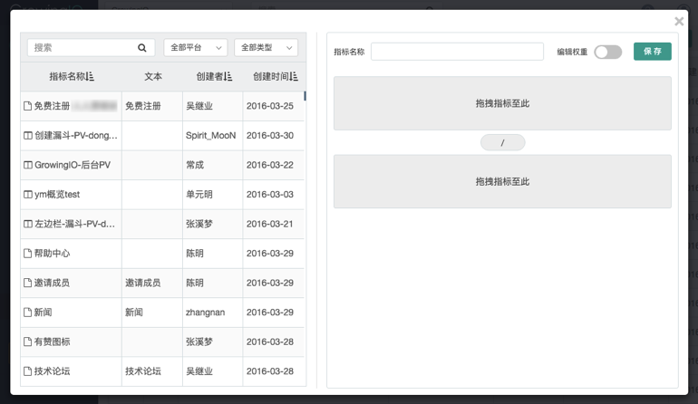
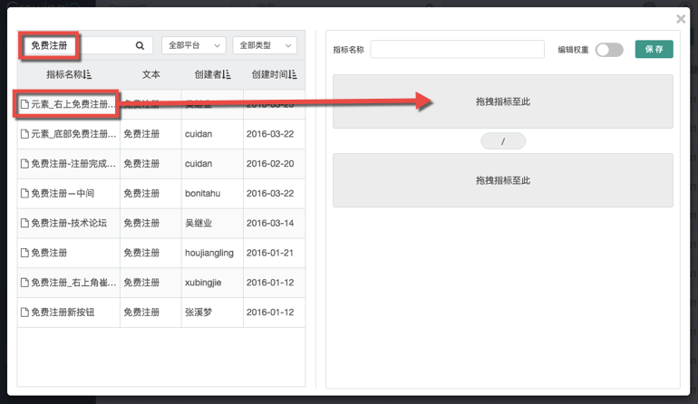
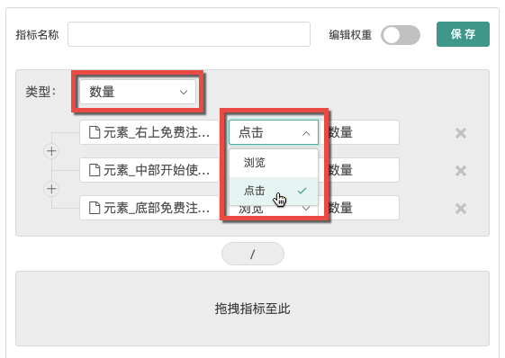
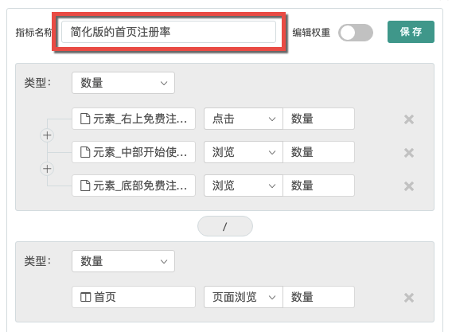

# 第三步：创建复合指标

圈选了数据之后，可以直接利用简单指标进行分析，或者通过【创建复合指标】来将各种简单指标加权组合, 来更综合地衡量业务运营情况。

在左侧菜单的【指标管理】中，点击右上角的【创建复合指标】按钮。

在弹出的浮窗中，左侧为所有圈选过的页面和元素，右侧可以设定复合指标的计算方式。

复合指标的计算公式，主要取决于您对自己业务的理解。在这个例子中，我们将通过一个简化的计算公式来演示如何创建复合指标：

首页转化率=(右上角按钮点击量+中部按钮点击量+底部按钮点击量)/首页PV

在左侧列表中找到上一步圈选的三个按钮（可以搜索哦），拖拽到右侧的第一个虚线框中（表示分子）。

将这些元素的属性改为“点击”“数量”。

在左侧列表中找到首页，拖拽到右侧的第二个虚线框中（表示分母），属性为“页面浏览”“数量”。

将上面的名字改为“简化版的首页注册率”，保存，复合指标创建完成！

