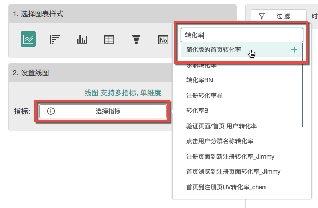
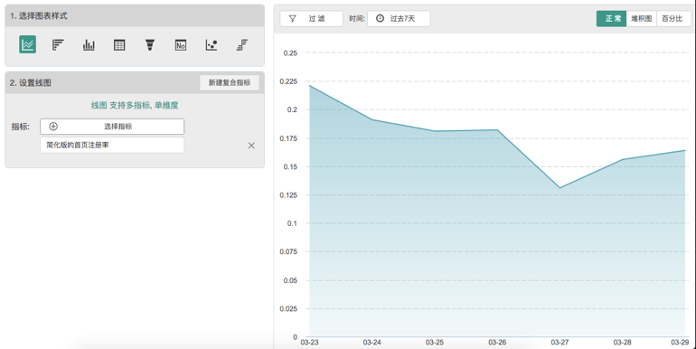
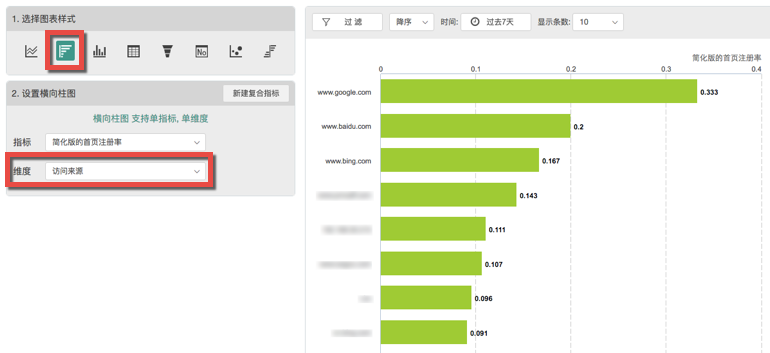
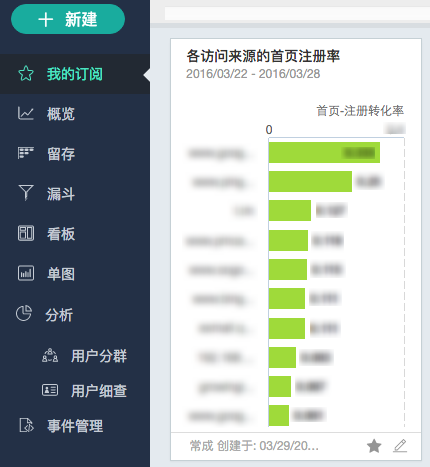

# 第四步：制作图表

接下来就是最轻松的一步：将数据可视化。

点击【新建】，选择【单图】。

在【事件】一栏中，找到刚才建好的复合指标（可以用中文或者拼音搜索）。

点击添加该指标，马上就可以看到最近七天的转化率波动趋势了。

由于我们的目标是分析不同来源的转化率的差别，因此在图表样式中选择了第一个“横向柱图”，这时转化率指标自动变到了X轴。再在维度一栏中找到“访问来源”，拖入Y轴中，就瞬间生成了各个不同来源的转化率指标。可以看到最近这段时间内，Google过来的用户转化率比百度和必应的都要高一些，也许下一步我们应该提高在Google上的投入了……

给这张图取一个名字，点击【保存】，图表制作完成！以后就可以在【我的订阅】中每天查看了。

PS：图表还有多种玩法，详见[这里](https://help.growingio.com/Features/allchart/chart.html)。图表还可以组合成为看板，详见[这里](https://help.growingio.com/Features/allchart/dashboard.html)。