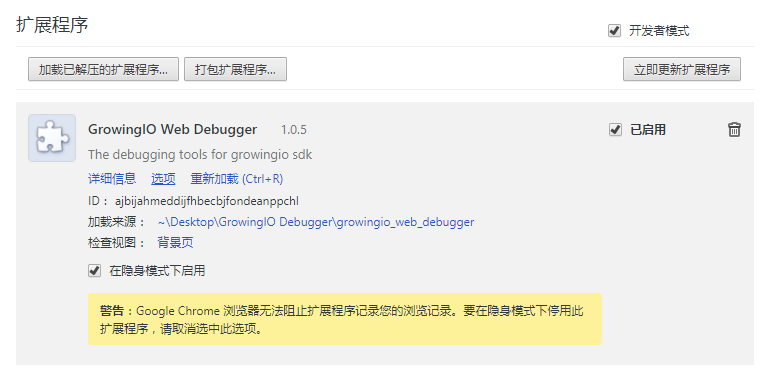
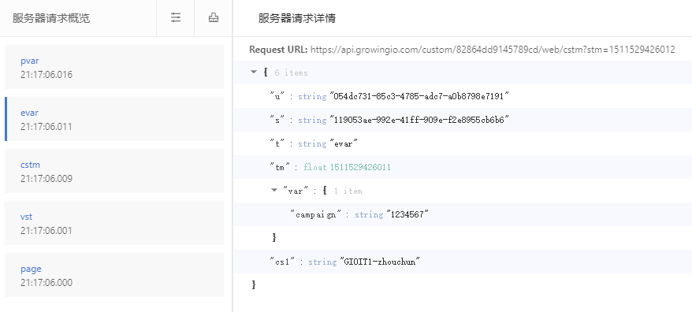

# GrowingIO Web Debugger 安装

GrowingIO Web Debugger 是基于Chrome浏览器的一个插件，用户需要按照标准Chrome浏览器插件的步骤和方式来按照。具体的步骤如下：

1、下载 [growingio\_web\_debugger.zip](http://assets.growingio.com/growingio_web_debugger.zip) 到本地磁盘，并完成解压缩到一个目录下。

2、打开Chrome浏览器，点击右侧的自定义及控制Google Chrome，在弹出的窗口中点击更多工具-&gt;扩展程序选项

3、进入到扩展程序管理界面后，勾选开发者模式选项框，然后点击加载已解压的扩展程序按钮，并在弹出的对话框中找到GrowingIO Web Debugger解压后的地址，点击确定。GrowingIO Web Debugger将会作为Chrome的扩展程序安装完毕。如下图

4、注意观察浏览器右上角的扩展程序图标如果出现如下图所示的图标，则表示GrowingIO Web Debugger安装成功!

5、在添加了GrowingIO Web SDK的页面上，在空白处点击右键-&gt;检查打开Chrome浏览器的Dev Tool，可以看到出现了一个新的Tab为：GIO Web Debugger。实施技术顾问就可以在这个Tab页面上进行添加代码后的质量验证工作了。如下图

在此概览中可能出现的数据日志含义分别有：

page：页面浏览数据

vst：用户访问数据

clck：点击行为数据

chng：输入框行为

sbmt：表单提交行为

cstm：“自定义事件+事件级变量” 数据

pvar：“页面级变量” 数据

evar：“转化变量” 数据

ppl：“用户变量” 数据

