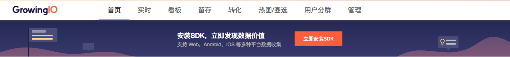

# SDK接入指南（JS）

GrowingIO 提供 JS SDK,将代码插入到客户的网页中以后我们就可以接收用户的行为数据了。

我们的 JS SDK 支持 IE6 以上的 IE 浏览器、360 浏览器、谷歌浏览器、搜狗浏览器、火狐浏览器、QQ 浏览器、Safari 浏览器、Maxthon、Mobile 端浏览器，并且全面支持 H5，覆盖市面上主流的浏览器。

## 获取JS SDK

您可以通过如下的简单步骤，新建网站产品，并且获取到 GrowingIO JS SDK：

1. 登录 GrowingIO
2. 点击立即安装SDK 

   

3. 点击左上角的新建按钮  
4. 点击添加新产品   
5. 选择平台「网站」   

如果您已经安装了产品，可以在应用管理中找到添加应用的按钮。

## 整合JS SDK至web 环境

将我们提供给您的 JS SDK 加入到您所需要分析的页面，请将我们给您提供的 JS SDK 复制到 `<head>` 和 `</head>` 标签之间即可, 例如：

```text
<head>
...
<script type='text/javascript'>
    var _vds = _vds || [];
    window._vds = _vds;
    (function(){
      _vds.push(['setAccountId', '您的项目ID']);
      (function() {
        var vds = document.createElement('script');
        vds.type='text/javascript';
        vds.async = true;
        vds.src = ('https:' == document.location.protocol ? 'https://' : 'http://') + 'assets.growingio.com/vds.js';
        var s = document.getElementsByTagName('script')[0];
        s.parentNode.insertBefore(vds, s);
      })();
    })();
</script>
...
</head>
```

成功加载SDK后GrowingIO会自动采集页面浏览量、元素浏览、点击量。我们还提供一些高级设置：用户属性、页面属性、采样采集、禁用元素浏览量采集、单页面应用启用hashtag、开启输入文本框内容等。具体设置方法请参考下面的详细说明。

## 用户自定义维度

GrowingIO 的数据分析工具本身提供了例如 “访问来源”，“关键字”，“城市”,“操作系统"，”浏览器“等等这些维度。这些维度都可以和用户创建的指标进行多维的分析。但是往往不能满足用户对数据多维度分析的要求，因为每个公司的产品都有各自的用户维度，比如客户所服务的公司，用户正在使用的产品版本等等。GrowingIO 为了能够让数据分析变得更加的灵活，我们在 JS SDK 中提供了用户自定义维度的API接口:

```text
_vds.push(['setCS1', 'CS1的key', 'CS1的value']);
_vds.push(['setCS2', 'CS2的key', 'CS2的value']);
_vds.push(['setCS3', 'CS3的key', 'CS3的value']);
...
_vds.push(['setCS10', 'CS10的key', 'CS10的value']);
```

在 JS SDK 中，我们总计支持上传 10 个自定义维度 CS1 - CS10，**所有CS属性都必须是用户的属性，不能是订单 ID，商品ID 等和用户没有确定的关联关系的属性。**

**CS字段设置条件和限制**

1. CS 字段不能是和用户没有直接关系的属性，比如不能是订单 ID，商品 ID 等。
2. CS1 字段：在 GrowingIO 系统中用于识别注册用户的身份，因此 CS1 的 value 必须填写用户的唯一身份标示 ID。
3. CS2 字段：在 GrowingIO 系统中用于识别 SaaS 客户的租户，因此所有的 SaaS 用户必须填写租户的唯一身份标示 ID，非 SaaS 用户不做限定。
4. 对于未登录用户，不要设置任何CS字段。
5. 如果没有用到所有的CS字段，剩下的可以不设置。
6. 同一个CS字段，必须保持在各个平台意义相同。

如下例子中，总计上传 4 个用户属性，分别是：

**CS1:** user\_id:100324  
** CS2:** company\_id:943123  
** CS3:** user\_name:张溪梦  
** CS4:** company\_name:GrowingIO  
**CS5:** sales\_name:销售员小王

```text
    <script type='text/javascript'>
        var _vds = _vds || [];
        window._vds = _vds;
        (function(){
          _vds.push(['setAccountId', '您的项目ID']);

          _vds.push(['setCS1', 'user_id', '100324']);
          _vds.push(['setCS2', 'company_id', '943123']);
          _vds.push(['setCS3', 'user_name', '张溪梦']);
          _vds.push(['setCS4', 'company_name', 'GrowingIO']);
          _vds.push(['setCS5', 'sales_name', '销售员小王']);

          (function() {
            var vds = document.createElement('script');
            vds.type='text/javascript';
            vds.async = true;
            vds.src = ('https:' == document.location.protocol ? 'https://' : 'http://') + 'dn-growing.qbox.me/vds.js';
            var s = document.getElementsByTagName('script')[0];
            s.parentNode.insertBefore(vds, s);
          })();
        })();
    </script>
```

**在上传成功两小时后，您需要在「项目管理-项目配置-CS 配置中」进行字段配置和激活，配置成功后便可开始使用 CS 字段进行分析。配置过程可参考 **[**属性数据\(CS\)上传配置文档**](https://docs.growingio.com/attribution-data.html)**。**

## JS SDK高级功能说明

JS SDK 有一些高级功能，可以通过配置的方式开启，具体是在集成代码里面添加。

**开启采样采集**

比如按照 1/20 的比例采样。采样原则默认按照用户 ID 来采样。

```text
    _vds.push(['setSampling', 20])
```

**过滤爬虫数据**

搜索引擎的爬虫爬网页会产生pv数据，可以通过trackBot过滤这部分爬虫数据。

```text
    _vds.push(['trackBot', false])
```

**禁用元素浏览量采集**

GrowingIO 提供两种采集，元素浏览和元素点击/修改等交互行为。对于内容基本固定的网站来说，可以直接禁用元素浏览量采集。

```text
    _vds.push(['setImp', false])
```

 **启用 hashtag 作为页面收集**

我们默认不会把 hashtag 识别成页面URL的一部分。对于使用 hashtag 作为单页应用页面切换的网站来说，您可以使用`enableHT`来监听 hashtag 的变化，并区分页面来收集页面数据，每次 hashtag 改变都会触发一次PV，hashtag 的信息也会记录在页面URL中。

```text
    _vds.push(['enableHT', true])
```

**设置数据采集黑名单**

如果您希望过滤一些内容，可以在网站 DOM 结点上设置 growing-ignore 属性，这样这个容器里所有的元素的浏览量和点击量都不会被采集。

```text
    <div growing-ignore='true'>
      …
    </div>
```

**开启输入文本框内容采集**

由于输入文本框可能涉及一些隐私信息，比如账号、密码等，GrowingIO在采集数据的时候默认不采集输入文本框的数据。如果您希望采集某些文本框输入内容，比如搜索词，可以在input标签中设置growing-track属性，这样该文本框中的输入内容就会被采集到。如果input类型是password，即使开启内容采集，也不会采集该文本框的输入内容。

```text
    <input type='text' growing-track='true' />
```

JS代码请以售前人员提供的为主，进行正确添加。

至此您的 SDK 整合已经完成，我们就可以接收您的数据，之后您可以登录 www.growingio.com 的网站即可开始进行圈选。

**手动设置采集文本信息**

对于一些图片或者区块，可以通过设置 title 或者 data-growing-title 属性来设置采集点点文本。比如，

```text
<li data-growing-title="上一页" 
                 class="ant-pagination-disabled ant-pagination-prev">
  <a></a>
</li>
```

这时，采集到的 li 结点的内容就是_"上一页"_。

更多的文本信息规则，可以参考[第4节：What\(内容\)](https://sishen.gitbooks.io/gio-js-book/dom/4what.html)和[第1节：内容规则](https://sishen.gitbooks.io/gio-js-book/5/1.html)。

**手动设置采集位置信息**

除了内容以外，元素在列表里所在位置在某些场景下也是非常重要的信息，比如对于推荐广告位而言，我们是希望知道哪个位置的点击率最高。GrowingIO SDK 会自动识别列表元素，并附带上元素在列表里的位置。

LI 标签、TR 标签、DL 标签，会被自动识别为列表元素，列表内所有元素结点都会附带上位置信息。其他标签默认并不会带有位置信息，比如一些用 DIV 标签做的平铺容器。对于这种情况，可以使用 data-growing-idx。当在容器 DOM 结点上设置 data-growing-idx 属性，容器内的所有 DOM 元素同样，都会继承该属性值。比如

```text
<div data-growing-idx="1">
  <div class="left-container">
    
  </div>
  <div class="right-container">
    <h3 class="title">
      文章一标题
    </h3>
  </div>
</div>
```

更多的位置信息规则，可以参考[第2节：位置规则](https://sishen.gitbooks.io/gio-js-book/5/2.html)。

**手动发送页面浏览事件（PV）**  
以下情况GrowingIO会采集页面浏览数据：

* 页面被渲染一次  
* 页面URL发生变化

当页面局部刷新，URL没有发生变化，GIO无法自动统计页面浏览量时，您可以手动发送页面浏览事件。

```text
_vds.trackPV();
```

## 注意事项

**Angular 1.4 以下版本冲突**

目前 Angular 1.4 以下版本与GrowingIO使用的MutationObserver 有冲突，这个是 Angular 的 bug，不好解决。我们建议您升级到 Angular 1.4 或者按照上述“禁用显示内容采集”方法关闭 impression 记录。

 **允许iframe加载**

在GrowingIO 平台上使用可视化圈选指标功能需要使用 iframe 来加载目标页面。如果您的网站禁止了 iframe 加载，就无法正常使用圈选功能定义指标，需要设置允许iframe加载。

如果您的网站使用https协议，需将配置修改成

```text
X-Frame-Options: Allow-From https://www.growingio.com
```

如果您的网站使用http协议，需将配置修改成

```text
X-Frame-Options: Allow-From http://www.growingio.com
```

**请勿复写window对象**

可视化圈选指标功能需要保证您的网站与GrowingIO平台之间的通信。如果window.top、window.parent、window.name、window.location被复写，将导致无法圈选。

 **页面内部嵌入的iframe元素如何加载SDK和圈选** iframe 元素可以将一个页面嵌入到另一个页面里，iframe 元素会创建包含另外一个文档的内联框架（即行内框架）。简单理解iframe可以将多个相互独立的页面展示在一页上。所以我们需要在iframe内部再次加载SDK代码收集iframe内部的元素浏览、点击数据。 同普通网页加载SDK方式相同，将SDK复制到iframe标签内部即可完成SDK安装。

