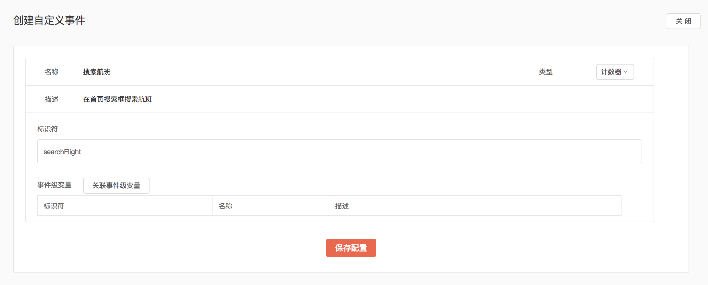
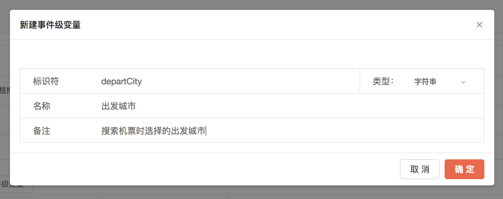

# 自定义数据上传&配置指南

如果您使用的2.0或以上版本的SDK，请参考[此文档](../sdk-2.x-wen-dang/zi-ding-yi-shu-ju-shang-chuan-pei-zhi-zhi-dao.md)进行自定义数据的上传和配置。

## “自定义事件” 上传方式

如您所知，您的APP或网页在集成了 GrowingIO 的 SDK 之后，它将会自动地为您采集一系列用户行为数据，并在 GrowingIO 分析后台供您制成数据分析报表。除上述的用户行为数据（或称为无埋点数据）之外，GrowingIO 还提供了自定义事件的 API 接口，供您上传一些自定义的数据指标及维度。

上述的 “自定义事件” 在GrowingIO分析后台体现为一个 “指标”，而 ”事件级变量“ 则是一个 ”维度“。

如您需要，请参考本页内容，完成此类自定义数据的上传。

请注意，自定义事件的个数上限为500个，事件级变量的个数上限为100个（并非每个事件可附带100个变量，而是整个项目中只可以有100个事件级变量）。

## “自定义数据 ”上传步骤

### 总体流程

1. 从数据需求出发，梳理指标、维度
2. 在 【管理】-【自定义事件和变量】 中完成配置
3. 在代码中完成 API 调用
4. 数据校验

以下针对上述 4 个步骤进行详细说明。

#### 第一步：从数据需求到具体 “指标+维度”

在GrowingIO上着手进行任何分析之前，首先要确定的一个问题是：如何设计 “指标+维度”的体系？对于无埋点数据，我们通过圈选确定 “指标”，而“维度” 则由 GrowingIO 提供了数个[预定义的维度](https://docs.growingio.com/growingio-shu-ju-mo-xing/yu-ding-yi-wei-du.html)。对于自定义数据，我们可以相对更自由地选择 “指标+维度”的体系。

更具体的说，从一个实际场景出发，我们需要确定在分析中需要用到哪些量化的值，然后用什么样的维度来分解这些值。例如，对于电商在分析用户下单情况时，用户的下单量，下单金额就是我们需要量化的 “指标”，而每个订单所含具体商品、商品分类、优惠券信息等就是“维度”。 那么对于下单这件事，我们就可以这样设计“指标+维度”：

指标：

* 订单总量
* 订单总金额

维度：

* 商品ID/名称
* 商品SKU
* 优惠券名称
* 收货地址
* ...

那么现在很明显了，订单总量与订单总金额这两个指标，需要用“自定义事件”来实现；商品ID/名称、优惠券名称等维度，则用 “事件级变量” 来实现。

在设计“指标+维度”体系时可能需要注意：

* Android、iOS 以及 Web 端不需要区分：对于这三端，可以只定义一个指标，而不需要分别对三端定义三个指标。举例来说，“订单总量”这个指标可以包含三端的总量，在 GrowingIO 平台分析时用预定义维度“网站/手机应用”或者“操作系统”就可以拆分三端分别的量。考虑到自定义事件和事件级变量均有最大个数上限，不建议拆分三端而占用事件数。

#### 第二步:在 “自定义事件和变量”中完成配置

当我们完成“指标+维度”的设计之后,请勿直接开始代码的部署,需要先到 GrowingIO 后台找到 【管理】-【自定义事件和变量】 功能，在其中完成对应的配置。

**自定义事件配置:**

对于每一个自定义事件,建议您在配置之前,先按下表列出配置细项,其中

* 名称 ==&gt; GrowingIO 后台指标名称
* 描述 ==&gt; 可选，仅作备注使用
* 标识符 ==&gt; 此在事件代码中的标识，可以为英文、下划线和数字，大小写敏感
* 事件级变量 ==&gt; 此事件下属的事件级变量
* 类型 ==&gt; 计数器（递增1）或数值（递增任意值）


将上面列好的配置，填入自定义事件配置界面，如下图：



点击保存配置，即完成了自定义事件的配置。再点击“关联事件级变量”来新建或关联已有事件级变量。

#### 事件级变量配置：

对每一个事件级变量，建议您在配置之前，先按下表列出配置细项，其中

* 变量名称 ==&gt; GrowingIO 后台维度名称
* 变量描述 ==&gt; 可选，仅作备注使用
* 变量标识符 ==&gt; 此变量在代码中的标识，可以为英文、下划线和数字，大小写敏感
* 类型 ==&gt; 可以是字符串或数值（注意：只有在您希望对此事件级变量进行运算时，才需选择数值类型。其他情况建议您优先选择字符串类型。因为一旦选择数值类型，此变量便会作为一个运算项，而无法再图表中展示）


将上面列好的配置，填入事件级变量配置界面，如下图：



点击确定，即完成了事件级变量的配置。

#### 第三步：代码部署

在完成了配置后，即可在代码中完成以上设计的 “自定义事件和变量” 的部署。具体的说，就是调用 GrowingIO 提供的API接口，上传数据。

**Web 端接口：**

* 接口定义：

```text
window._vds.track(event_name, properties)
```

* 示例：

```text
_vds.track("signup", {name: "GrowingIO发布会", time: "20180101"})
```

#### Android 端接口：

* 接口定义：

```text
public class GrowingIO {
    public GrowingIO track(String eventName, JSONObject properties)
}
```

* 示例：

```text
GrowingIO.getInstance().track("signup", {"name": "GrowingIO发布会", "time": "20180101"});
```

#### iOS 端接口：

* 接口定义：

```text
@interface Growing: NSObject
+ (void)track: (NSString *) event properties: (nullable NSDictionary *) properties;
@end
```

* 示例：

```text
[Growing track:@"signup"
    properties: @{
        @"name": @"GrowingIO发布会",
        @"time": @"20180101"}];
```

Tips：如果您的事件中不带任何事件级变量，在调用接口时，不可以直接在 properties 处赋值 nil 或 null。可以随便传一个 json 对象如 \`{"foo": "blabla"}\`，只要在 GrowingIO 后台配置此事件时不配置任何事件级变量即可。

#### 第四步：数据校验

在完成了【管理】-【自定义事件和变量】 的配置，以及代码实施后，我们当然需要对数据是否成功上传进行校验。校验工作分为两步完成。

**数据校验第一步：本地开发环境校验**

GrowingIO 提供了 SDK debug 模式以及 debug 工具，来帮助您完成数据的校验。

**Web 端**

对 Web 端的开发者，GrowingIO 提供了 Chrome 浏览器插件形式的 debug 工具，请在[这里](https://docs.growingio.com/growingio-web-debugger.html)下载安装。

debug 工具的工作界面如下图：


* 在 cstm 条目中，可以看到上传的 “自定义事件+事件级变量” 数据
* 在各条目中，都可以找到 “CS字段” 对应的数据

**移动端**

对移动端的开发者，GrowingIO 的 SDK 提供了 debug 模式，在 SDK 初始化代码中可以找到。如下图：

Android：


**注：如果您 Android 的包添加了截图中代码仍无法打印出 GrowingIO 相关 log 的话，在**`GrowingIO.startWithConfiguration()`**方法后，添加:**`GConfig.DEBUG = true;`

iOS：


开启 debug 模式后，您需要在app上触发一下打点事件，在打出的log里搜索上述关键字就能找到对应自定义事件&变量上传的数据。

**数据校验第二步：GrowingIO 后台图表验证**

在 GrowingIO 分析后台，找到 “单图” - “新建事件分析”，然后在图表中选择您设计好的 “指标+维度”，查看是否有数据。当然，您需要首先确保您的自定义事件或变量确实有被触发。

至此，您已经完成了 “自定义数据” 的上传，如您在配置或添加代码中有任何疑问，请联系您的客户成功经理咨询，或在工单系统中反馈问题。谢谢。

