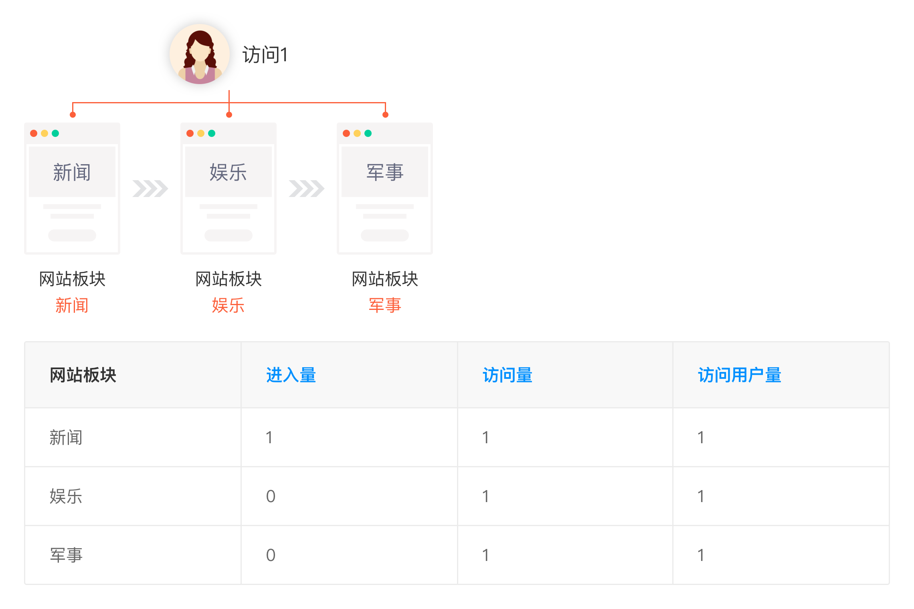
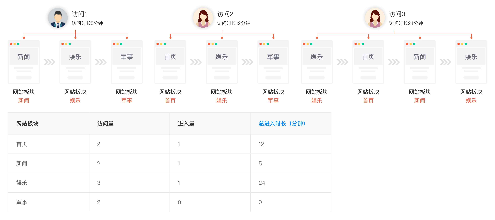
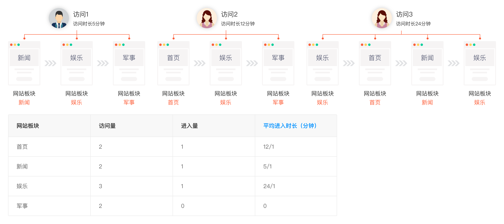
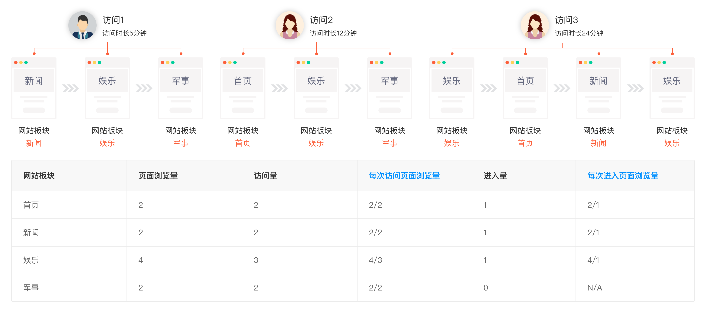
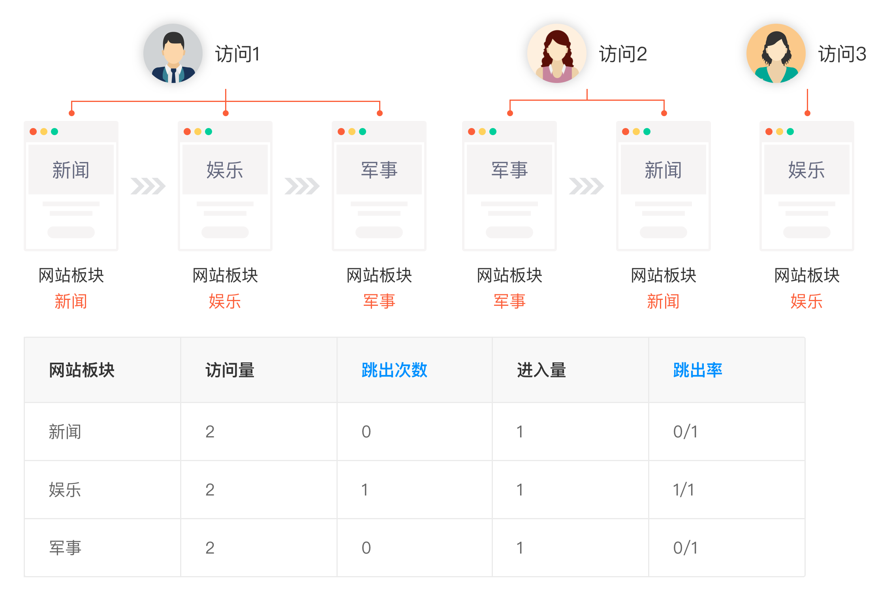

# 网站页面级维度增强

GrowingIO的数据模型提供三个预定义页面级维度，它们是：页面、域名、页面来源；根据不同版本提供若干自定义页面级变量来保存页面级别的维度信息。这些页面级维度在和预定义指标进行分解计算时将按照如下算法来进行计算。

**页面级维度和进入量、访问量、访问用户量**

1. 进入量 访问用户进入网站进行访问的数量。当该指标被页面级维度分解时，指从当前页面级维度的当前值进入（以当前页面级维度的当前值作为当前页面级维度的第一个值）的那些访问的数量。在作为指标单独使用或者被除页面级维度以外的维度分解时，进入量在数值上等于访问量。 
2. 访问量 对网站进行访问的数量。用户从进入网站到离开为止的一个相对完整连续的操作过程定义为一个访问。如果访问中存在着30分钟不操作，则旧的访问结束。如果之后又有后续操作，则新的访问开始。 
3. 访问用户量 对网站有过访问的用户的数量

**页面级变量和退出次数、退出率**

1. 退出次数  
   用户退出网站的数量。当该指标被页面级维度分解时，指从当前页面级维度的当前值退出（以当前页面级维度的当前值作为当前页面级维度的最后一个值）的那些访问的数量。在作为指标单独使用或者被除页面级维度以外的维度分解时退出次数在数值上等于访问量。

2. 退出率 当该指标被页面级维度分解时，指从当前页面级维度的当前值的退出次数（以当前页面级维度的当前值作为当前页面级维度的最后一个值）占对当前页面级维度的当前值的访问的比率。在作为指标单独使用或者被除页面级维度以外的维度分解时退出率在数值上等于100%。退出率是一个预定义复合指标，计算公式为：退出率 = 退出次数 / 访问量。

**页面级变量和访问用户人均访问次数、访问用户人均进入次数**

1. 访问用户人均访问次数 平均每个用户访问网站的次数。当该指标被页面级维度分解时，指浏览过当前页面级维度的当前值的用户平均访问过当前页面级维度的当前值的次数。访问用户人均访问次数是一个预定义复合指标，计算公式为：访问用户人均访问次数 = 访问量 / 访问用户量。 
2. 访问用户人均进入次数 平均每个访问用户进入网站进行访问的数量。当该指标被页面级维度分解时，指浏览过当前页面级维度的当前值的用户平均从当前页面级维度的当前值进入的次数。 访问用户人均进入次数是一个预定义复合指标，计算公式为：访问用户人均进入次数 = 进入量 / 访问用户量。

**页面级维度和总进入时长（分钟）**

1. 总进入时长（分钟） 用户进入网站进行访问的总时长，以分钟作为单位展示。当该指标被页面级维度分解时，指从当前页面级维度的当前值进入（以当前页面级维度的当前值作为第一个值）的那些访问的总时长。在作为指标单独使用或者被除页面级维度以外的维度分解时“总进入时长（分钟）”在数值上等于“总访问量时长（分钟）”。

**页面级维度和平均进入时长（分钟）**

1. 平均进入时长（分钟） 用户平均每次进入网站进行访问的平均时长，以分钟作为单位展示。当该指标被页面级维度分解时，指从当前页面级维度的当前值进入（以当前页面级维度的当前值作为当前页面级维度的第一个值）的那些访问的平均时长。在作为指标单独使用或者被除页面级维度以外的维度分解时“平均进入时长（分钟）”在数值上等于“平均访问量时长（分钟）”。  平均进入时长（分钟）是一个预定义复合指标，计算公式为： 平均进入时长（分钟） =  总进入时长（分钟） / 进入量。

**页面级维度和每次访问页面浏览量、每次进入页面浏览量**

1. 每次访问页面浏览量 平均每次访问带来的页面浏览的数量。当该指标被页面级维度分解时，指对当前页面级维度的当前值有过页面浏览的那些访问中对当前页面级维度的当前值的页面浏览量。每次访问页面浏览量是一个预定义复合指标，计算公式为：每次访问页面浏览量 = 页面浏览量 / 访问量。 
2. 每次进入页面浏览量 平均每次进入带来的页面浏览的数量。当该指标被页面级维度分解时，指从当前页面级维度的当前值进入（以当前页面级维度的当前值作为当前页面级维度的第一个值）的那些访问在平均情况下产生的总页面浏览量。每次进入页面浏览量是一个预定义复合指标，计算公式为：每次进入页面浏览量 =  进入总页面浏览量 / 进入量。

**页面级维度和跳出次数、跳出率**

1. 跳出次数  
   在对网站的访问过程中，只有一条页面浏览数据的访问的次数。当该指标被页面级维度分解时，指从当前页面级维度的当前值进入的那些访问中，只有一条页面浏览数据的访问的次数。

2. 跳出率 在对网站的访问过程中，只有一个页面浏览的访问占所有访问的比率。当该指标被页面级维度分解时，指从当前页面级维度的当前值进入的访问里面，只有一个页面浏览的访问的比率。跳出率是一个预定义复合指标，计算公式为：跳出率 = 跳出次数 / 进入量

