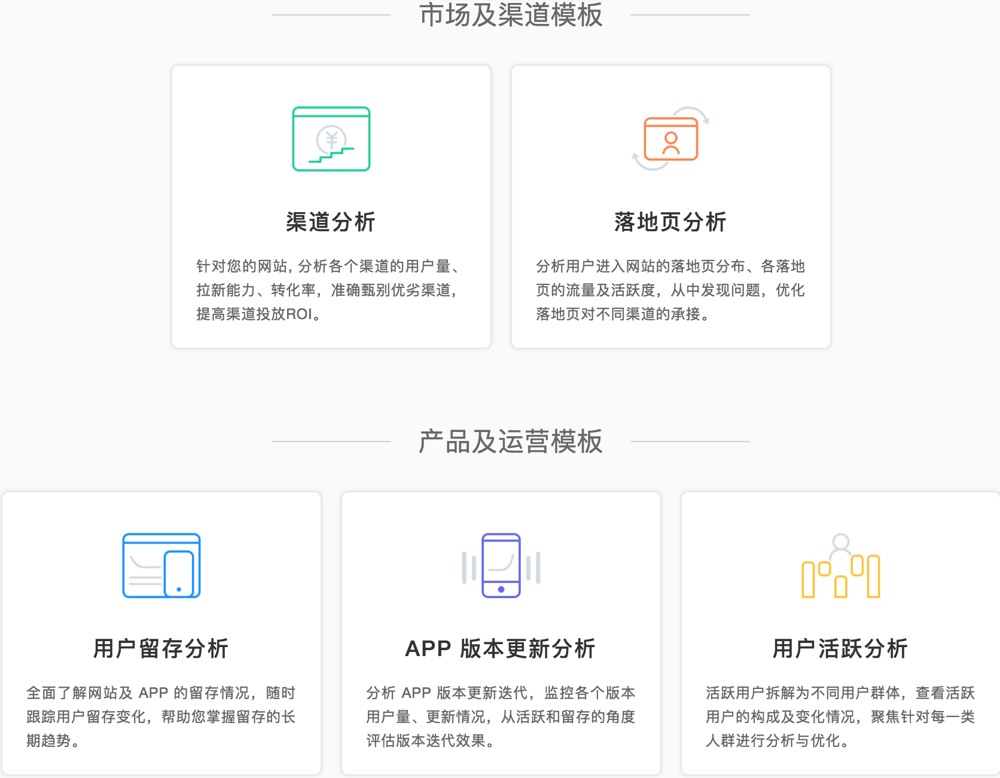

# 业务场景

## 简介

为了帮助您更快地分析常见的业务场景，我们将部分常见场景总结成了**"业务场景"**模板供您参考。业务场景模板暂时只支持查看和部分自定义，暂时不支持完全自定义编辑和下载等功能。

## 内容介绍

我们提供了5个常用的业务模板，它们的适用平台情况如下：

| 模板名称 | 适用平台 |
| :--- | :--- |
| 渠道分析 | Web |
| 落地页分析 | Web |
| 用户留存分析 | 不限，全平台 |
| APP 版本更新分析 | 移动 APP |
| 用户活跃分析 | 不限，全平台 |

具体业务价值如下图中描述所示：

